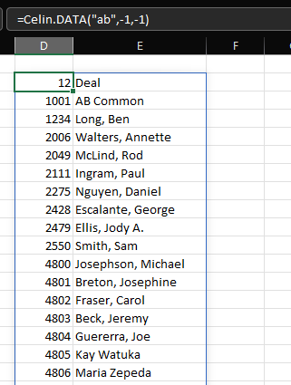
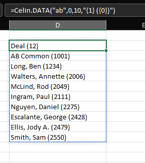

### Celin.DATA

Display named data on a sheet using the Spill functionality (see below).

#### Example

Display full results of `ab` data.

```
=Celin.DATA("ab",-1,-1)
```



Format first 10 rows of `ab` results (display rows from 0 - 9).

(see format syntax below)

```
=Celin.DATA("ab",0,10,"{1} ({0})")
```



### Reference

[Dynamic array formulas and spilled array behaviour](https://support.microsoft.com/en-us/office/dynamic-array-formulas-and-spilled-array-behavior-205c6b06-03ba-4151-89a1-87a7eb36e531)

[Format Syntax](https://docs.microsoft.com/en-us/dotnet/api/system.string.format?view=net-6.0)
