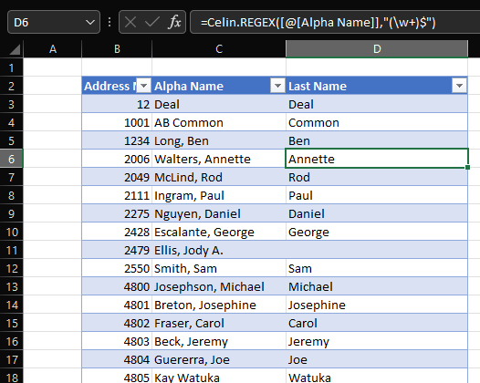

### Celin.REGEX

A regular expression function.


#### Example

Get the last name from a cell.

```
=Celin.REGEX([@[Alpha Name]],"(\w+)$")
```



### Reference

[Regular Expression 101](https://regex101.com/)
