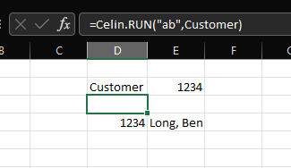

<link href="../assets/prism-dark.min.css" rel="stylesheet" />
<link href="../assets/style.css" rel="stylesheet">
<script src="../assets/prism-core.min.js"></script>
<script src="../assets/prism-cql.js"></script>

### Celin.RUN

Runs a query when a trigger cell range changes.

#### Example

Create an address book table, named `ab` with address book number and name.
Select the address number from a cell named `Customer`.

<div class="codeblock">
<pre><code class="language-cql">/* Address Book Table */
#ab = 
/* Table */
f0101
/* Fields (Alias) */
(an8,alph)
/* Where ab number equals cell name Customer */
all(an8=@Customer)</code></pre>
</div>

Trigger a re-run of the query whenever the `Customer` cell value changes.

```
=Celin.RUN("ab",Customer)
```

Display the results with the `DATA` function.

```
=Celin.DATA("ab",-1,-1)
```


