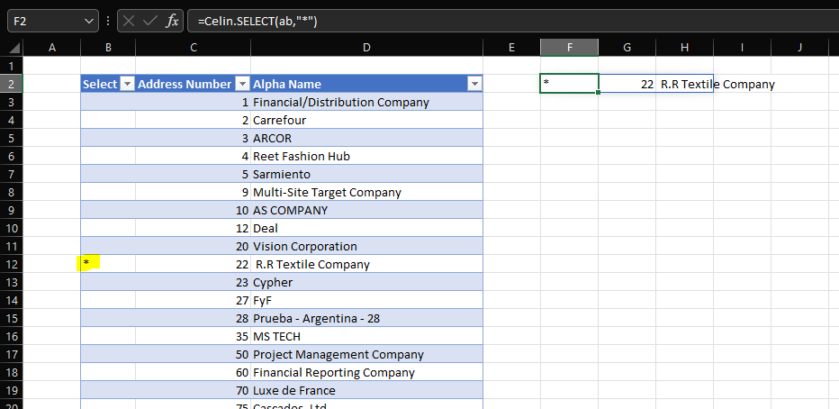

<link href="../assets/prism-dark.min.css" rel="stylesheet" />
<link href="../assets/style.css" rel="stylesheet">
<script src="../assets/prism-core.min.js"></script>
<script src="../assets/prism-cql.js"></script>

### Celin.SELECT

Selects a row from a table or a cell range.

#### Example

Create an address book table, named `ab` with address book number and name.

<div class="codeblock">
<pre><code class="language-cql">/* Address Book Table */
#ab = 
/* Table */
f0101
/* Fields (Alias) */
(an8,alph)</code></pre>
</div>

Insert a `Select` column on the table's left and enter the select formula (must have at least two empty columns on its right).

```
=Celin.SELECT(ab,"*")
```

Enter the marker ("*") in the `select` column.


