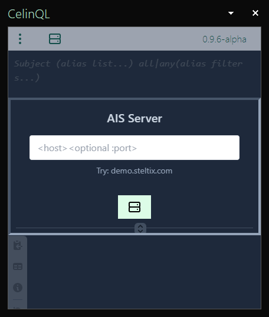
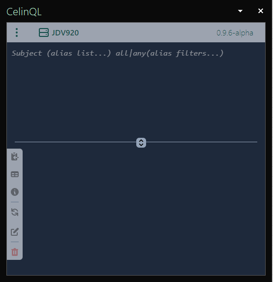
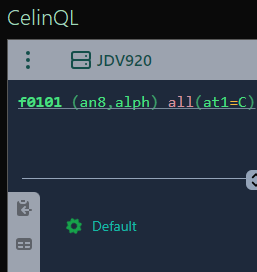
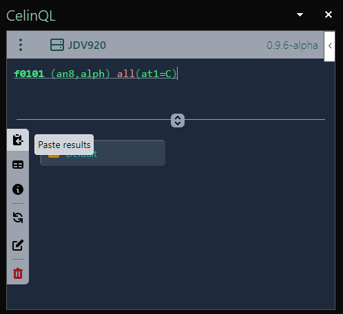

<link href="assets/prism-dark.min.css" rel="stylesheet" />
<link href="assets/style.css" rel="stylesheet">

# Getting Started

## AIS Server

The first time the add-ins is opened, it will prompt for the AIS server:

**Note:** AIS must be served over _https_ protocol (Steltix' AIS demo is served as _https://demo.steltix.com_).

### Query Interface

The interface is split with the editor in the upper half and results in the lower half. The between bar can be adjusted as required.

#### Editor

The editor accepts one or more `cql` statements, separated by `; (semi colon)`.

For example, try:

<pre><code class="language-cql">f0101 (an8,alph) all(at1=C)</code></pre>

This will extract address number (an8) and name (alph) from the address book table (f0101) where the type (at1) is C.

To run the query, either use the Alt-key+R shortcut, or the top-left dropdown menu.

#### Results

A running query shows up in the results pane with a spinning wheel.

Once finished, the icon turns to folder if successful or warning sign if error or empty results.

Successful results can be pasted by selecting the folder item and click the Past button on top left.  The resulting rows will be pasted into the active worksheet starting from the current cell.

