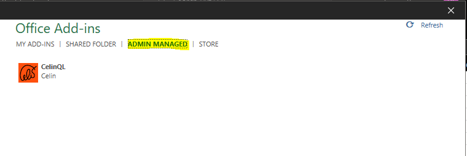

# Installation

There are three options for installing the Add-Ins using a manifest file.

1. Use Excel on-line side-loading.
2. Deploy in admin centre (the recommended way).
3. As a Trusted add-ins catalog.

### Excel on-line side-loadinge

 This is the quickest way to test an add-ins, but only works for Excel running in a browser.

1. Open Excel [on-line](https://www.office.com/launch/excel?auth=2) and create a new document.
2. Select `Insert -> Office Add-ins`.
3. Select the `Upload My Add-in` option and upload the manifest file.

Once the Addin is loaded, it can be opended with a button on the Data Ribbon.

### Deploy in admin centre

This is the recommended way to deploy add-ins across an organisation.

For more, see [Centralized Deployment of add-ins](https://docs.microsoft.com/en-us/microsoft-365/admin/manage/manage-deployment-of-add-ins?view=o365-worldwide).

Once deployed, the add-ins is available on the `ADMIN MANAGED` tab.

### As a Trusted add-ins catalog

Copy the manifest file to a network share.

Then add the network share as Trusted Catalog by selecting `Options` in Excel (`File -> Options`) and from there `Trust Center -> Trust Center Settings... -> Trusted Add-in Catalogs` and add the share as Trusted Catalog Address.

The add-ins is then available on the `SHARED FOLDER` tab.

